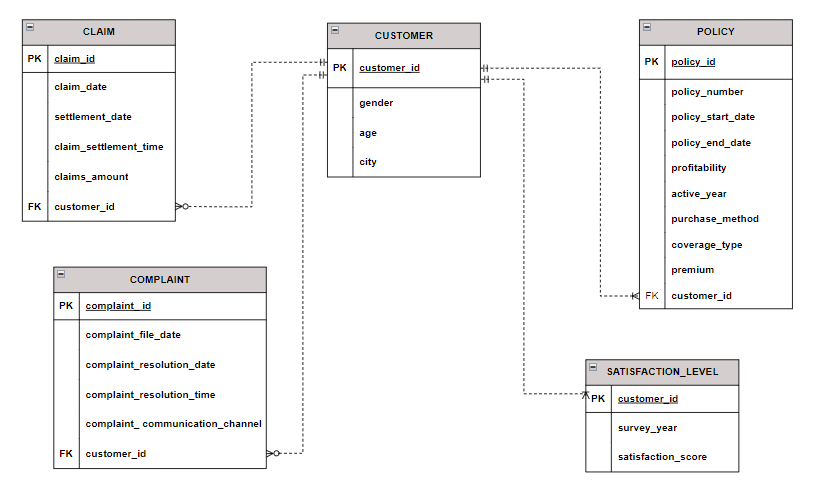
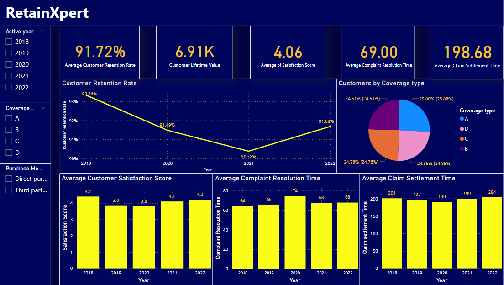
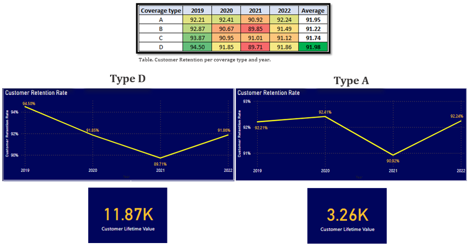
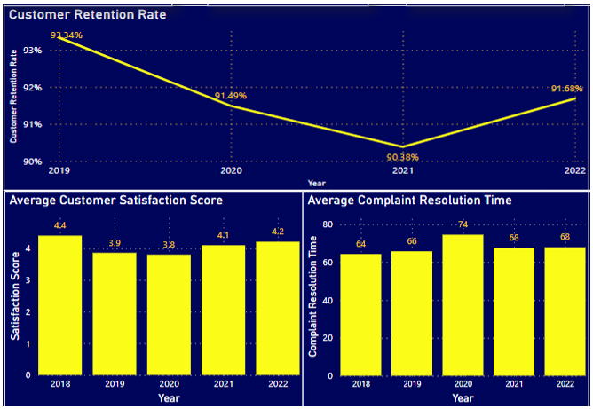
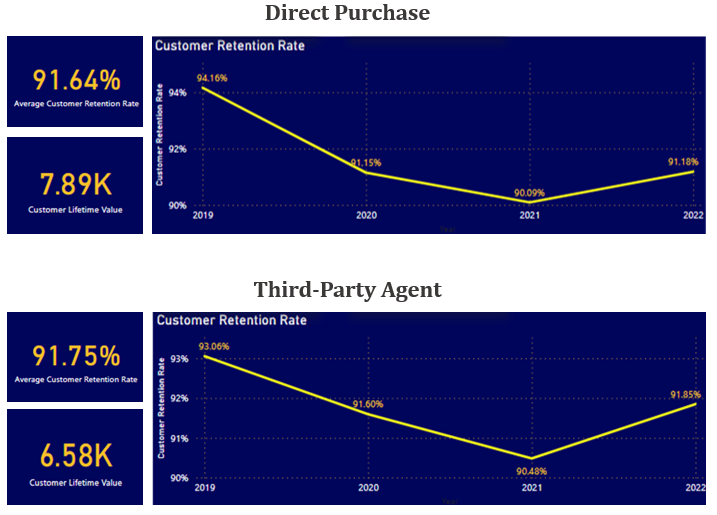
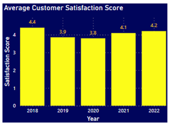

# RetainXpert-Elevating-Customer-Satisfaction-&-Loyalty

## 1.	Problem Statement
The car insurance industry is highly competitive, with several providers racing for customer loyalty. As customer acquisition costs rise, insurance companies in Ontario need to focus on customer retention to look for sustainable growth and profitability.

Customer retention has become a challenge for IceCrystal Insurance (a hypothetical company). The absence of data-driven insights hinders the company´s ability to ensure the satisfaction of existing policyholders, thereby reducing its potential for steady revenue growth and cross-selling opportunities.

## 2.	About RetainXpert
### 2.1.	Purpose
The primary purpose of RetainXpert is to provide IceCrystal with meaningful insights on customer retention, for car insurance policies. The goal is to use these insights to help the company refine its policies and communications strategy, thereby increasing customer satisfaction and loyalty.

### 2.2.	Objectives
- **Dashboard Development**: Develop an interactive dashboard highlighting critical data points about customer retention. This dashboard should empower IceCrystal to make informed decisions and optimize their retention strategies.
- **Key Performance Indicators (KPIs)**: Establish key performance indicators (KPIs) based on the analysis to track and improve customer retention rate.
- **Factors Driving Retention**: Use analytical tools and techniques to identify key factors impacting customer retention within IceCrystal's car insurance policies. 

## 3.	Key Concepts
There are two purchase mediums for any car insurance policy in IceCrystal: 
- Third-Party Agent
- Direct Purchase

There 4 types of coverage types: A, B, C, or D:
- A: Mandatory coverage (Liability, Accident Benefits, Property Damage).
-	B: Comprehensive coverage (Mandatory coverage + fire, theft, vandalism, weather events).
-	C: Collision or upset coverage (Mandatory coverage + family protection, vehicle replacement if damaged in an accident regardless of the fault).
-	D: All perils coverage.

## 4.	Data Preprocessing
### 4.1.	Data Extraction
The dataset is composed of 24 columns and 27366 rows. It was crafted to be representative of the car insurance industry in the 10 biggest cities of Ontario. With this purpose, extensive research was conducted on settlement times for car insurance claims, complaints resolution times, customer reviews, industry trends, service timeframes, coverages, premiums, and communication channels.

### 4.2.	Data Cleaning and Transformation
The dataset was thoroughly examined using MS Excel to ensure the proper treatment of null values, blanks, and impossible values. We ensured data standardization by converting dates to a standard format and lowercasing all text data. Additionally, to maintain data quality all data labeled as irrelevant was removed.

A few columns were added to enrich the dataset and make it more suitable for our analysis:
-	**Active year**: contains the value of the year the policy was active; it was calculated based on the policy start date.
-	**Claim settlement time**: contains the difference between the Settlement date and the Claim date expressed as an integer.
-	**Profitability**: contains the difference between the Claim amount and the Premium expressed as an integer.
-	**Complaint resolution time**: contains the difference between the Complaint resolution date and the Complaint file date expressed as an integer.

### 4.3.	Data Validity
In order to ensure the validity and reliability of our data, we conducted a divergent validity test to assess the relationships between specific variables. The following variables and their correlations were assessed:
-	Age and Customer Satisfaction Score: 0.004254041
-	Claims Amount and Age: -0.028955424
-	Premium and Claim Resolution Date: 0.023084653
-	Policy Start Date and Age: 0.006499196
-	Policy Number and Premium: 0.022806213

The divergent validity test results indicate that the correlations between these variables are generally low. This suggests that the variables being examined are measuring different aspects and are not highly interrelated.

### 4.4.	Data Normalization
This step is essential for organizing and structuring the data to eliminate redundancy and improve data integrity. Using MS Excel, we identified dependencies, determined primary and foreign keys, and split the data into appropriate tables to achieve a normalized dataset structure. The dataset was normalized to 3NF removing all partial and transitive dependencies. The following ERD illustrates the dataset structure after normalization: 

### 4.5.	Loading to Power BI
After completing the necessary data preprocessing and calculations, the normalized dataset was loaded into Power BI to create the interactive dashboard.

## 5.	KPIs Definition
The following KPIs were identified as relevant for the analysis and the dashboard creation, based on the information present in the dataset:
-	Customer Retention Rate (CRR): This rate measures the proportion of customers the company retains over a given period. 
-	Customer Lifetime Value (CLV): This is a measurement of how valuable a customer is for the company. It informs the insurer about how much profit they have earned from a customer throughout their business relationship.
-	Customer Satisfaction Score (CSAT): This score is a basic measure of a customer’s satisfaction with a company’s products or services. 
-	Average Claims Settlement Time: This KPI measures the average time taken by the insurer to settle claims. It's a crucial metric as a shorter settlement time can improve customer satisfaction and retention.
-	Average Complaints Resolution Time: This KPI measures the average time taken by the insurer to resolve complaints. Like the previous one, a shorter resolution time can enhance customer satisfaction and retention.

## 6.	Dashboard Overview

## 7.	Analysis Questions
### 7.1.	Is there any specific coverage type that has a higher retention rate? What is its Customer Lifetime Value?

Type D coverage has the highest average Customer Retention Rate with an average of 91.98% and the highest Customer Lifetime Value (CLV) of CAD 11,870. However, when we look at the retention rate trend, we can see its retention has decreased since 2019. 
On the other hand, Type A coverage has the most stable Customer Retention Rate throughout the years but has the lowest CLV of CAD 3,260. 
This shows that IceCrystal should focus more on strategies to increase the retention of customers with type D coverage, even more, considering that this is the segment that provides the most value to the company.

### 7.2.	Which KPIs identified during the analysis have a direct impact on customer retention?

The short answer is the Average Customer Satisfaction Score and the Average Complaint Resolution Time. Both have a direct impact on customer retention. 

A higher value in the satisfaction score for a given year will result in a higher retention rate for the following year. For instance, in 2018, the company achieved its highest Customer Satisfaction Score of 4.4 points, while in the subsequent year, it attained its highest Customer Retention Rate of 93.34%. Conversely, in 2020, the company recorded its lowest Customer Satisfaction Score of 3.8, followed by its lowest Customer Retention Rate of 90.38% in 2021.

When considering Complaint Resolution Time, a higher value in a given year appears to correlate with a reduction in the Retention Rate for the following year. For instance, in 2020, the company experienced its highest Complaint Resolution Time of 74 days, coinciding with its lowest Customer Retention Rate of 90.38% in the subsequent year.

Interestingly, Claim Settlement Time does not seem to have a significant impact on customer retention. This finding aligns with existing studies indicating that customers often anticipate delays in claim processing and prioritize the outcome of the claim over the processing time.

### 7.3.	Is there any purchase method IceCrystal should further enhance to retain high-value customers?

Yes, the company should prioritize direct purchases with the IceCrystal Sales Team. Despite having the lowest retention rate at 91.6 customers who acquire their car insurance directly generate the highest Customer Lifetime Value of CAD 7890. This indicates that these customers will yield greater profits for the company over the duration of their business relationship.

On the other hand, third-party agents have a slightly better retention rate of 91.75%. This could be explained by their provision of more personalized service. However, their commission represents from 8 to 10% of the premium value, resulting in a lower Customer Lifetime Value of CAD 6580. Thus, while third-party agents may offer personalized assistance, their involvement diminishes the long-term profitability of customer relationships.

### 7.4.	How satisfied are the customers with the service they receive?

The average Satisfaction Score over the five-year period stands at 4.06 out of 5 points, indicating a generally high level of satisfaction among customers with the auto insurance service provided by IceCrystal.

When we analyze the trend, we see the lowest score is 3.8 for 2020. This decline could be attributed to general customer dissatisfaction during the pandemic lockdown. Many customers were expecting premium discounts due to reduced mobility and lower risk of car accidents. However, such discounts were not uniformly applied, instead, premiums for renewals were increased contributing to a sense of discontent among customers.

## 8.	How is RetainXpert beneficial for the company?
-	Enhanced Decision-Making: Provide IceCrystal management with a deep understanding of factors influencing customer retention in the car insurance industry. 
-	Improved Customer Service: Enable customer service and claims handling teams to gain insights into customer behavior, preferences, and expectations. 
-	Potential Investments: Show potential investors the company's commitment and ability to retain its customer base and enhance satisfaction levels. 
-	Customer Confidence: Increase customer trust in the company by understanding their preferences and effectively addressing their needs. 

## 9.	Conclusion
In conclusion, RetainXpert represents a significant step forward for IceCrystal Insurance in addressing the challenge of customer retention within the highly competitive car insurance industry in Ontario.

RetainXpert supports internal decision-making processes and provides management with a deep understanding of customer retention factors, enabling the company to tailor its approach to meet the needs and expectations of its policyholders more effectively. By leveraging data-driven insights, IceCrystal can enhance its strategies for customer retention, leading to sustainable growth and profitability

Moving forward, IceCrystal can capitalize on RetainXpert’s insights to:
-	Implement targeted strategies, boosting retention for Type D coverage and increasing the Customer Lifetime Value.
-	Focus on personalized service to enhance customer satisfaction scores.
-	Reduce complaint resolution time for higher satisfaction.
-	Optimize web portal and phone calls for streamlined sales and claim processes providing a better customer experience.

## PowerBI Interactive Dashboard Link

## Contributors
Chris Portugalisa, Mohit Sharma

